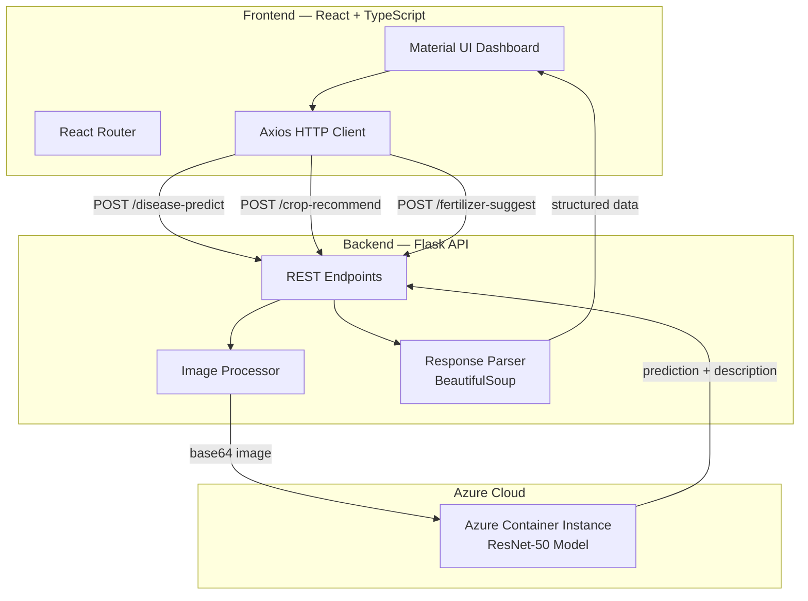

<div align="center">
  
  <br/>
  <h1>🌱 Harvestify: AI-Powered Plant Health Assistant</h1>
  <p><strong>Upload a leaf photo — instantly detect diseases, get crop recommendations, and receive fertilizer suggestions using AI.</strong></p>

  <p>
    <a href="LICENSE">
      
    </a>
    <a href="https://github.com/SohaibKhaliq/Harvestify-AI-Powered-Plant-Health-Assistant/stargazers">
      
    </a>
    <a href="https://github.com/SohaibKhaliq/Harvestify-AI-Powered-Plant-Health-Assistant/forks">
      
    </a>
    <a href="https://github.com/SohaibKhaliq/Harvestify-AI-Powered-Plant-Health-Assistant/commits/master">
      
    </a>
    
    
    
    
    
    
  </p>
</div>

---

## 📋 Table of Contents

- [Overview](#-overview)
- [Features](#-features)
- [Architecture](#-architecture)
- [Tech Stack](#-tech-stack)
- [Quick Start](#-quick-start)
- [Project Structure](#-project-structure)
- [API Reference](#-api-reference)
- [Deployment](#-deployment)
- [Contributing](#-contributing)
- [License](#-license)
- [FAQ](#-faq)

---

## 📖 Overview

Harvestify helps gardeners, farmers, and agriculturalists keep their plants healthy using AI. Upload a photo of a plant leaf and the system will:

1. **Detect diseases** using a deep learning model (ResNet-50) deployed on Azure Container Instances
2. **Recommend crops** based on soil and weather conditions
3. **Suggest fertilizers** to optimize plant growth

The app has two components: a **Flask REST API** backend that processes images and queries the AI model, and a **React + TypeScript** frontend with Material UI for a modern user experience. Deployed on Microsoft Azure.

---

## ✨ Features

| Feature | Description | Status |
|---------|-------------|--------|
| 🔬 **Disease Detection** | Upload leaf photo → AI identifies disease + causes + cures | ✅ Stable |
| 🌾 **Crop Recommendation** | Get optimal crops based on soil and climate inputs | ✅ Stable |
| 🧪 **Fertilizer Suggestion** | Personalized fertilizer recommendations | ✅ Stable |
| ⚡ **Real-time Analysis** | Instant processing with Azure-hosted AI model | ✅ Stable |
| 🎨 **Modern UI** | React 18 + Material UI + TypeScript | ✅ Stable |
| ☁️ **Azure Deployed** | Frontend on Azure Static Web Apps, API on App Service | ✅ Stable |

---

## 🏗 Architecture



---

## 🛠 Tech Stack

| Component | Technology | Purpose |
|-----------|-----------|---------|
| **Backend** | Python 3.9+ / Flask 2.x | REST API server |
| **ML Model** | ResNet-50 (TensorFlow/Keras) | Plant disease classification |
| **Model Hosting** | Azure Container Instances | Scored model endpoint |
| **Frontend** | React 18 + TypeScript 5 | User interface |
| **UI Library** | Material UI 5 (MUI) | Component library |
| **HTTP Client** | Axios | API communication |
| **Forms** | Formik + Yup | Form validation |
| **Carousel** | react-material-ui-carousel | Image galleries |
| **Deployment** | Azure Static Web Apps | Frontend hosting |
| **Image Processing** | Pillow | Image preprocessing |
| **Parsing** | BeautifulSoup4 | HTML response parsing |

---

## 🚀 Quick Start

### Prerequisites

- Python 3.9+
- Node.js 18+
- npm

### Backend Setup

```bash
# Clone
git clone https://github.com/SohaibKhaliq/Harvestify-AI-Powered-Plant-Health-Assistant.git
cd Harvestify-AI-Powered-Plant-Health-Assistant/Backend

# Create virtual environment
python -m venv venv
source venv/bin/activate  # Windows: venv\Scripts\activate

# Install dependencies
pip install -r requirements.txt

# Run the API server
python app.py
```

### Frontend Setup

```bash
cd ../Frontend

# Install dependencies
npm install

# Start development server
npm start
```

The app will be available at **http://localhost:3000** (frontend) with the API at **http://localhost:5000** (backend).

---

## 📂 Project Structure

```
Harvestify-AI-Powered-Plant-Health-Assistant/
├── Backend/
│   ├── app.py                 # Flask API server (routes, image processing, Azure ML client)
│   ├── requirements.txt       # Python dependencies
│   ├── Procfile               # Heroku deployment config
│   ├── .gitignore
│   └── LICENSE
├── Frontend/
│   ├── public/                # Static assets (favicon, manifest, robots.txt)
│   ├── src/
│   │   ├── App.tsx            # Root component with React Router
│   │   ├── index.tsx          # Entry point
│   │   └── components/        # Page components (home, disease, crop, fertilizer, contact)
│   ├── package.json           # Node dependencies
│   ├── tsconfig.json          # TypeScript configuration
│   ├── staticwebapp.config.json  # Azure Static Web Apps config
│   └── eslint.json            # Linting rules
├── Web App Interface.png      # Screenshot for README
├── README.md
└── LICENSE
```

---

## 📡 API Reference

### `POST /disease-predict`

Upload a plant leaf image and receive disease diagnosis.

**Request:** Multipart form-data with:
- `file`: Image file (JPEG/PNG)
- `imageUrl`: Image URL (alternative source)

**Response (disease detected):**
```json
{
  "prediction": {
    "crop": "Tomato",
    "disease": "Early Blight",
    "cause": ["1. Fungal pathogen Alternaria solani", "2. Warm, humid conditions"],
    "cure": ["1. Apply fungicide containing chlorothalonil", "2. Remove infected leaves"]
  },
  "msg": "detected"
}
```

### `GET /`

Health check endpoint.

```json
{
  "status": "ok"
}
```

---

## ☁️ Deployment

### Azure (Current)

- **Frontend**: Azure Static Web Apps at `https://salmon-river-0feb8641e.5.azurestaticapps.net/`
- **Backend**: Azure App Service (Python)
- **ML Model**: Azure Container Instances (ResNet-50)

### Deploy Backend

```bash
# Deploy Flask app to Azure App Service
az webapp up --name harvestify-api --runtime PYTHON:3.9
```

### Deploy Frontend

```bash
# Build for production
cd Frontend
npm run build

# Deploy using Azure Static Web Apps CLI
npx @azure/static-web-apps-cli deploy
```

---

## 🤝 Contributing

Contributions welcome! See [CONTRIBUTING.md](CONTRIBUTING.md).

---

## 📄 License

MIT License — see [LICENSE](LICENSE).

---

## ❓ FAQ

<details>
<summary><strong>What AI model does Harvestify use?</strong></summary>
A ResNet-50 convolutional neural network trained on plant disease datasets, hosted on Azure Container Instances.
</details>

<details>
<summary><strong>Can I use this offline?</strong></summary>
The backend requires access to the Azure-hosted ML model, so an internet connection is needed for disease detection.
</details>

---

<div align="center">
  <sub>🌱 Keeping plants healthy together with AI</sub>
  <br/>
  <sub>⭐ Star this repo if you find it useful!</sub>
</div>
